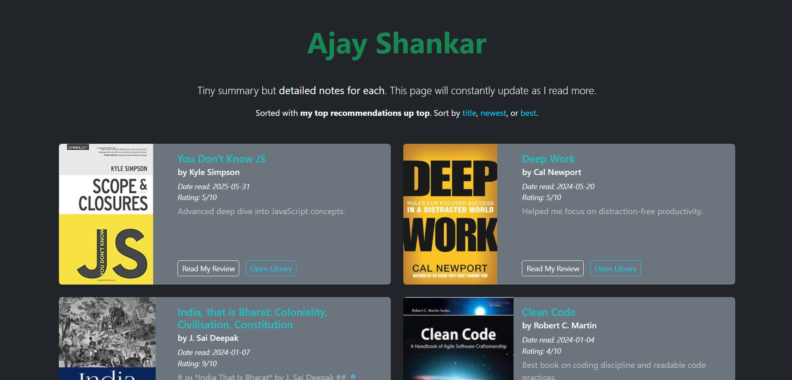
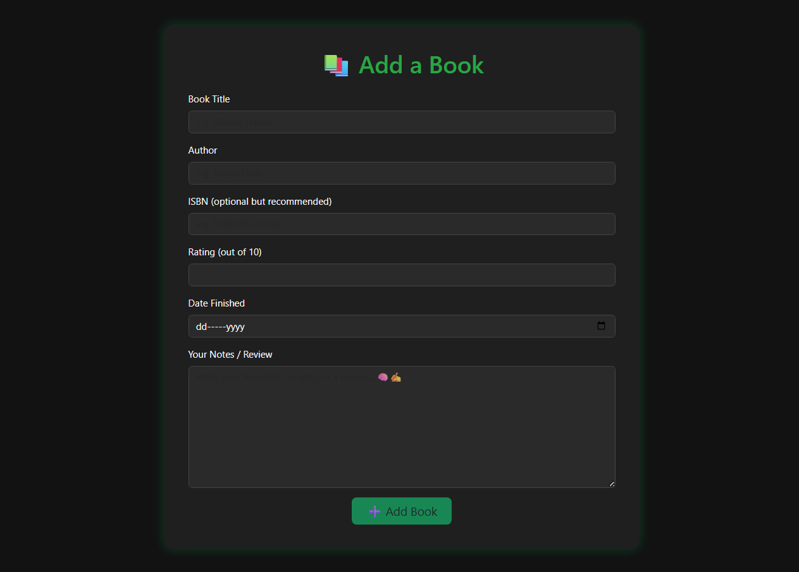

# 📚 Book Notes App

A full-stack web application to keep track of books you've read — along with personal notes, ratings, and reading history.

## 🌟 Features

- 📖 View all books with cover images, summaries, and reading metadata  
- 📝 Add, edit, and delete book entries with markdown-enabled notes  
- ⭐ Sort books by title, rating, or date read  
- 📦 PostgreSQL database integration  
- 🎨 Clean and responsive UI with Bootstrap 5 and custom styles  
- 🖼️ Fallback cover images for missing book covers  

## 🚀 Tech Stack

| Layer       | Technology              |
|-------------|--------------------------|
| Backend     | Node.js, Express         |
| Frontend    | EJS Templates, Bootstrap 5 |
| Database    | PostgreSQL               |
| Utilities   | Axios, Marked.js (Markdown to HTML) |
| Deployment  | Localhost (Node.js runtime) |

---

## 📂 Project Structure

```
book-notes-app/
│
├── public/                # Static files
│   ├── styles/            # Custom CSS
│   └── images/            # Book cover fallback
│
├── views/                 # EJS templates
│   ├── index.ejs
│   ├── add.ejs
│   ├── edit.ejs
│   └── book.ejs
│
├── index.js               # Express app entry point
├── package.json           # Project dependencies and scripts
└── README.md              # You’re reading it!
```

---

## 🖼️ Screenshots

### 🏠 Home Page  


### ➕ Add Book  


---

## 🛠️ Setup Instructions

### 1. Clone the Repo

```bash
git clone https://github.com/shankar-ajay/Book-Notes.git
cd book-notes-app
```

### 2. Install Dependencies

```bash
npm install
```

### 3. Configure PostgreSQL

Create a local PostgreSQL database named `book-notes`.

Update the `index.js` file with your DB credentials:

```js
const db = new pg.Client({
  user: "your_username",
  host: "localhost",
  database: "book-notes",
  password: "your_password",
  port: 5432,
});
```

### 4. Create the `books` Table

```sql
CREATE TABLE books (
  id SERIAL PRIMARY KEY,
  title TEXT NOT NULL,
  author TEXT NOT NULL,
  rating INT,
  date_read DATE,
  notes TEXT,
  isbn TEXT,
  cover_url TEXT
);
```

### 5. Start the Server

```bash
node index.js
```

Then open your browser at: [http://localhost:3000](http://localhost:3000)

---

### 6. Add a book

Go to the "/add" url to add a new book.

### 6. Edit a book

Click on the "Read My Review" for a book. Then add "/edit" to edit the reviews for a book.


## 🧪 Example Code Snippet

```js
// Render Markdown notes as HTML
book.notes = marked(book.notes);
```

---

## 🔧 Future Improvements

- Add search functionality  
- Add filtering by tags/genres  
- Add user authentication  
- Deploy on Render / Railway / Vercel  
- Add pagination for long book lists  

---

## 📄 License

MIT License — Feel free to use, modify, and share.

---

## ✍️ Author

**Ajay Shankar**  
📧 Contact: [Your Email or Portfolio URL Here]